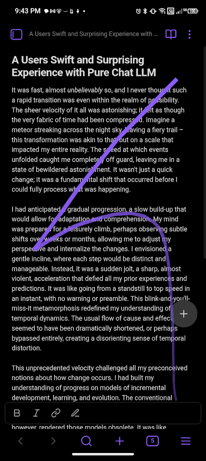
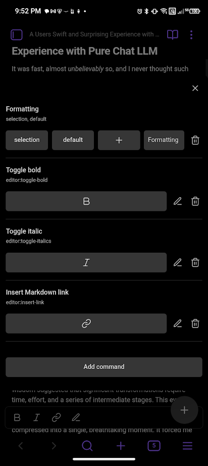
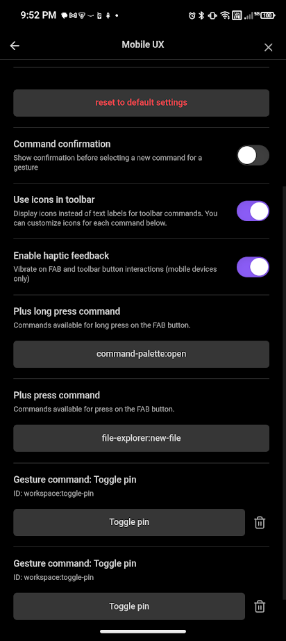

# Mobile UX

A mobile-optimized UX enhancement plugin for [Obsidian](https://obsidian.md) that provides a floating action button (FAB) and context-aware toolbars.

[Ask me for mobile friendly features](https://github.com/TheJusticeMan/obsidian-mobile-plugin/issues/new)

## Gestures

**Gestures are the heart of this plugin.** You can create completely custom gestures to trigger any command in Obsidian.

1.  **Draw a gesture**: Drag the Floating Action Button (FAB) to draw a shape.
2.  **Assign a command**: When you release the FAB, if the gesture is not recognized, you will be prompted to assign a command to it.
3.  **Execute**: Next time you draw the same shape, the assigned command will be executed.

Gestures are matched based on the shape, so you can draw them at any size or speed.

## Features

### Customizable Floating Action Button (FAB)

- **Tap**: Executes a primary command (default: Create new note).
- **Long-press**: Executes a secondary command (default: Open command palette).
- **Gestures**: Drag the button to draw shapes and trigger any command.
- **Smart positioning**: Anchors to the active editor leaf, ensuring it doesn't overlap navigation elements.

|  |  |  |  |
| :------------------------ | :------------------------ | :------------------------------ | :------------------------ |

### Context-Aware Toolbars

Dynamic toolbars that adapt based on your cursor position and selection:

| Context        | Description                            |
| :------------- | :------------------------------------- |
| **Selection**  | Text is selected                       |
| **List**       | Cursor in bullet/ordered list          |
| **Task**       | Cursor in task list item               |
| **Heading**    | Cursor in heading                      |
| **Code Block** | Cursor in code block                   |
| **Table**      | Cursor in table                        |
| **Blockquote** | Cursor in blockquote                   |
| **Link**       | Cursor on a link                       |
| **Default**    | Fallback when no other context matches |

#### Toolbar Features

- **Two-section settings**: Define toolbars in a library, then bind them to contexts.
- **Auto-concatenation**: Multiple toolbars bound to the same context are automatically merged.
- **Icon support**: Use Lucide icons with custom override capability.
- **Horizontal scrolling**: Scrolls when too many buttons to fit.
- **Editor focus preservation**: Keyboard stays open when using toolbar buttons.

### Tablet Mode

- **Force Tablet UI**: Toggle to force the tablet interface on mobile phones.
- **Keep in tablet mode**: Command to toggle this mode.

### Mobile Search

A dedicated search view optimized for mobile devices:

- **Sticky search input**: Always visible at the top of the results.
- **Infinite scrolling**: Efficiently loads results as you scroll (10 initial, 50 per batch).
- **File previews**: Shows a preview of the file content with caching for performance.
- **Date display**: Shows file modification date at the bottom corner of each preview (relative time for recent files).
- **File context menu**: Long-press/right-click on a result card for quick actions (open in new tab, open to the right, delete, copy file path).
- **Smart keyboard handling**: Automatically dismisses the keyboard when scrolling results.
- **Auto-focus**: Automatically focuses the search input when the sidebar opens.

## Installation

### Brat

1.  Install **BRAT** from the Community Plugins in Obsidian.
2.  Open the command palette and run `BRAT: Add a beta plugin for testing`.
3.  Enter the URL of this repository: `https://github.com/TheJusticeMan/obsidian-mobile-plugin`.
4.  Click **Add Plugin**.
5.  Enable the plugin in **Settings → Community Plugins**.

## Configuration

### Settings

| Setting                    | Description                                                    |
| :------------------------- | :------------------------------------------------------------- |
| **Show toolbars**          | Show context-aware toolbars at the bottom of the screen        |
| **Show FAB**               | Show the FAB button at the bottom right of the screen          |
| **Command confirmation**   | Show confirmation before selecting a new command for a gesture |
| **Use Icons**              | Toggle between icon and text display in toolbars               |
| **FAB long press**         | Select command to execute when the FAB is long-pressed         |
| **FAB press**              | Select command to execute when the FAB is pressed              |
| **Enable haptic feedback** | Vibrate on FAB and toolbar button interactions                 |
| **Gesture Commands**       | Manage your created gestures (rename, reassign, delete)        |
| **Reset to default**       | Restore all settings to their original defaults                |

### Toolbar Library

Create reusable toolbars with custom command sets:

1.  Click **Add Toolbar**.
2.  Give it a name (e.g., "Formatting").
3.  Add commands by their ID (e.g., `editor:toggle-bold`).
4.  Optionally set custom icons for each command.

### Context Bindings

Bind toolbars to editing contexts:

1.  Click **Add Binding**.
2.  Select a context type (Selection, List, Table, etc.).
3.  Select a toolbar from your library.
4.  Multiple bindings to the same context are auto-concatenated.

## Commands

| Command                       | Description                                        |
| :---------------------------- | :------------------------------------------------- |
| `Toggle wake lock`            | Keeps the screen awake while editing               |
| `Toggle Keep in tablet mode`  | Force tablet UI on phones                          |
| `Plus press`                  | Executes the command configured for FAB press      |
| `Plus long press`             | Executes the command configured for FAB long press |
| `Open mobile plugin settings` | Opens the settings modal for this plugin           |
| `Open Mobile Search`          | Opens the mobile-optimized search view             |

## Development

### Prerequisites

- Node.js v16 or higher
- npm

### Setup

```bash
# Clone the repository
git clone https://github.com/TheJusticeMan/obsidian-mobile-plugin.git

# Install dependencies
npm install

# Build for development (watch mode)
npm run dev

# Build for production
npm run build
```

### Project Structure

```
src/
├── main.ts               # Plugin entry point
├── fab.ts                # Floating Action Button manager
├── toolbar-extension.ts  # Context-aware toolbar ViewPlugin
├── mobile-search-leaf.ts # Mobile Search view
├── gesture-handler.ts    # Gesture recognition and handling
└── settings.ts           # Settings tab and interfaces
```

## License

[MIT](LICENSE)

## Author

[Justice Vellacott](https://github.com/TheJusticeMan)

## Support

If you encounter any issues or have feature requests, please [open an issue](https://github.com/TheJusticeMan/obsidian-mobile-plugin/issues) on GitHub.
